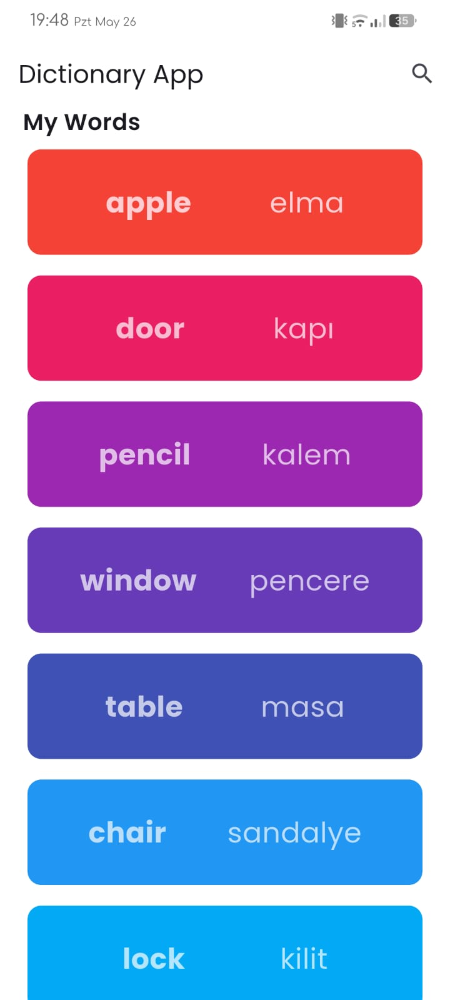
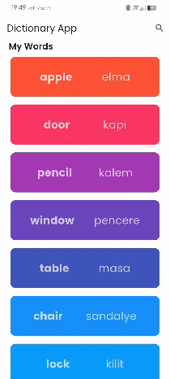

# 📘 Dictionary App

A simple and colorful Flutter dictionary app to help you learn basic English-Turkish word pairs. Ideal for beginners or kids learning new vocabulary!

---

## ✨ Features

- 📚 English to Turkish word translations  
- 🎨 Vibrant and intuitive UI design  
- 🧠 Easy to use and understand  
- 🔍 Search functionality

---

## 📱 Screenshot

  
    &nbsp;
  

## 🛠️ Technologies

- Flutter  
- Dart

## 👨‍💻 Developer

**Mehmet Emin Güler**  
📧 Email: [mhmt.eminguler@gmail.com](mailto:mhmt.eminguler@gmail.com)  
💻 GitHub: [github.com/meminglr](https://github.com/meminglr)
